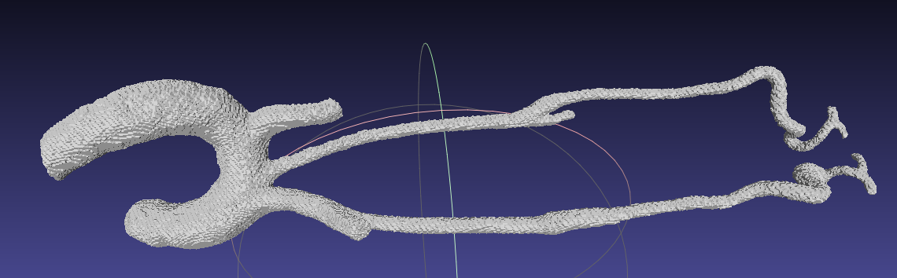

# Rapport

# **Abstract**

La reconstruction fidèle de l’aorte thoraco-abdominale à partir d’IRM segmentées constitue un prérequis essentiel pour la planification endovasculaire et la quantification automatisée de la tortuosité ainsi que des angles d’implantation. Nous présentons ici l’avancement à mi-parcours d’un projet visant à produire un pipeline autonome — indépendant de 3D Slicer [1] — capable de générer des maillages STL de haute qualité et de fournir immédiatement les principaux indicateurs géométriques.

Le corpus actuel se compose de dix volumes NIfTI déjà segmentés et de leurs maillages STL de référence. Deux méthodes non apprenantes sont comparées :

1. l’extraction d’iso-surface par Marching Cubes (seuil 0,5) [2] suivie d’un nettoyage morphologique ;
2. la reconstruction par Level-Set variationnel (Maurer Signed Distance) couplée à un lissage Poisson [3].

Les maillages obtenus sont remis à l’échelle, puis alignés sur le STL de référence grâce à un recalage global fondé sur les descripteurs FPFH et RANSAC [4], suivi d’un affinage par ICP point-to-plane bi-étagé [5]. Les performances sont évaluées selon quatre métriques : la distance quadratique moyenne (RMS), la distance de Hausdorff approchée, le ratio volumique et le Dice surfacique ± 1 mm. Sur deux cas tests, nous obtenons déjà **[Renseigner les métriques ici]** après l’étape de recalage.

Parallèlement, des pistes de densification volumique par interpolation inter-coupes et d’architectures voxel-to-mesh [6] sont explorées sur GPU Kaggle, mais leur validation nécessitera une volumétrie de données plus importante ; elles feront l’objet du rapport final.

Les prochaines étapes porteront sur l’automatisation du calcul des métriques de tortuosité (NTK) et le prototypage d’une application GUI indépendante — distribuée sous forme d’exécutable multiplate-forme — permettant à un clinicien de glisser-déposer un NIfTI et d’obtenir, en moins de dix minutes, un modèle 3D prêt pour la planification ou l’impression.

# 2. Données et formats d’imagerie

Le jeu de données comporte **10 acquisitions IRM** anonymisées, chacune ayant fait l’objet d’une segmentation binaire manuelle pour isoler l’arbre aortique. Les volumes sont stockés au format **NIfTI-1** (extension `.nii` ou `.nii.gz`), un format largement répandu en recherche pour son efficience et sa compatibilité avec les bibliothèques Python (NiBabel, SimpleITK) et MATLAB [7]. Chaque fichier NIfTI contient l’intégralité du volume 3D, avec une matrice affine (`qform`/`sform`) explicite garantissant la conservation des positions spatiales entre coupes.

En parallèle, pour chaque IRM, nous disposons d’un **maillage STL de référence**, issu d’un traitement clinique antérieur, servant de ground truth pour l’évaluation de nos reconstructions.

Le format **DICOM**, standard hospitalier, a été écarté à ce stade de R&D : en effet, bien qu’il offre une richesse de métadonnées indispensable en contexte clinique (informations patient, détails de protocole, time stamps, dose, annotations RTStruct/RTPlan), il se présente sous la forme d’une multitude de fichiers (un par coupe), ce qui complique l’intégration automatisée dans un pipeline Python pur [8].

Dans l’optique d’un workflow **léger et reproductible**, les volumes NIfTI permettent :

- un chargement unique du volume complet,
- une compression native (`.nii.gz`),
- un accès direct aux affines pour l’alignement ultérieur,
- une interopérabilité aisée avec des frameworks IA.

### Comparaison NIfTI vs DICOM pour le stockage des coupes IRM 2D

| **Critère** | **NIfTI** | **DICOM** |
| --- | --- | --- |
| **Fidélité des données** | • Volume unique 3D/4D sans perte, orientation claire via `qform/sform`. | • Un fichier par coupe, chaque header contient les informations de reconstruction du volume. |
| **Richesse des métadonnées** | • Dimensions voxels, orientation. • Aucune info patient ni protocole détaillé. | • Patient, étude, machine, paramétrage séquence, date/heure, dose, annotations RTStruct, etc. |
| **Structure & Taille** | • Un seul fichier (`.nii`, `.nii.gz`), facile à compresser. • Lecture immédiate du volume. | • Ensemble de fichiers DICOM volumineux, gestion PACS native. • Chargement initial plus long. |
| **Orientation spatiale** | • Affine explicite, conversions fiables si on respecte les conventions. | • Orientation définie par des tags DICOM ; fiable si la série est correctement construite. |
| **Compatibilité 3D Slicer** | • Chargement natif. • Risque d’inversion gauche-droite si conventions non respectées. | • Import DICOM natif, reconstruction automatique du volume 3D. |
| **Intégration au workflow** | • Recherche : Python (NiBabel, ITK), MATLAB, IA. • Transformation en DICOM possible en aval. | • Clinique : standard PACS. • Prise en charge de bout en bout (images, RTStructs, examens). |
| **Évolutions récentes** | • NIfTI-2 (64 bits), • BIDS (JSON pour métadonnées IRM). | • DICOM-SEG / DICOM-RT / DICOMweb pour l’imagerie de précision et l’IA. |
| **Cas d’usage typiques** | • Neuroimagerie (fMRI, DTI), pipelines IA médicaux, partage de données. | • Échanges cliniques, archivage, visualisation PACS, annotations et planification radiothérapie. |

Ce choix de NIfTI optimise le temps de prototypage et la reproductibilité.

# 3. Organisation du projet et environnement logiciel

| Plate-forme | Matériel | Usage | Outils |
| --- | --- | --- | --- |
| **PC-développement** | Intel Core i5-1135G7, 8 Go RAM, Windows 11 + WSL2 | exécution des scripts Marching Cubes / Level-Set, métriques, rédaction | **VS Code**, Python 3.11, venv, VTK 9.3, Open3D 0.18 |
| **Kaggle Notebooks** | Tesla T4 (16 Go VRAM) | essais exploratoires d’augmentation et de DL (non inclus ici) | MONAI, PyTorch 2.5 |
| **Gestion de version** | Git + GitHub privé | suivi du code, revue | GitHub Actions (lint, tests) |

### Détail de l’organisation :

- **Développement principal sur PC local** :
    
    Le cœur du développement, incluant les scripts de reconstruction 3D (Marching Cubes, Level-Set) et les métriques de comparaison entre reconstructions et références (notamment l’alignement, RMS, DiceCore), a été effectué sur un PC portable modeste.
    
    Ce choix reflète la volonté de garantir que la méthode soit exécutable sur des machines standards, sans nécessité de ressources matérielles importantes.
    
- **Explorations avancées sur Kaggle** :
    
    Afin d’étudier certaines pistes d’augmentation de données ou d’interpolation slice-to-slice pour enrichir les reconstructions, des essais exploratoires ont été réalisés sur **Kaggle Notebooks**.
    
    Les GPU Tesla T4 offerts sur Kaggle (16 Go de VRAM) ont permis de tester certaines méthodes sans contrainte matérielle locale.
    
    Toutefois, ces travaux restent **exploratoires** à ce stade et **n’entrent pas dans le périmètre** du rapport principal.
    
- **Suivi rigoureux avec Git et GitHub** :
    
    Deux dépôts GitHub privés ont été utilisés :
    
    - Un premier dépôt a servi à versionner l’ensemble du code lié aux méthodes classiques (reconstruction 3D avec Marching Cubes, Level-Set, métriques d’évaluation, alignement).
        
        Cela a permis d’assurer un suivi rigoureux, de favoriser la collaboration et de conserver l’historique des modifications importantes.
        
    - Un second dépôt distinct a été consacré aux expérimentations en **deep learning** (augmentation de données, interpolations slice-to-slice), de manière à bien séparer les approches classiques et apprenantes.

# 4. Méthodes de reconstruction 3D

Nous présentons trois approches non apprenantes pour générer un maillage 3D à partir de volumes NIfTI segmentés :

1. **Marching Cubes** comme baseline, simple et rapide.
2. **Level-Set variationnel** couplé à une reconstruction Poisson pour produire une surface lisse.
3. **Homogénéisation d’échelle** via comparaison de bounding boxes pour garantir la correspondance physique avec le STL de référence.

Ces méthodes sont entièrement reproductibles hors GPU, sans apprentissage profond, et implémentées en Python (VS Code) grâce à **SimpleITK**, **VTK**, **Open3D** et **trimesh**.

**Seuil d’extraction**

Dans Marching Cubes et Level-Set, la position de la surface est déterminée par un seuil. Avec une segmentation binaire (0 = extérieur, 1 = intérieur), on choisit naturellement `level = 0.5`, ce qui place la surface exactement à la frontière. En Python/Skimage, l’appel devient par exemple :

```python
python
CopierModifier
verts, faces, normals, _ = measure.marching_cubes(volume, level=0.5)

```

Un choix de seuil différent déplacerait la géométrie et altérerait la précision d’extraction.

**Marching Cubes**

La méthode Marching Cubes extrait une iso-surface à partir du volume binaire préalablement rééchantillonné de manière isotrope à 0,5 mm dans les trois directions (filtre ResampleImageFilter de SimpleITK avec interpolation nearest-neighbor pour préserver la nature binaire). Le volume est converti en vtkImageData, puis parcouru par vtkMarchingCubes avec un iso-niveau de 0,5 pour générer un maillage triangulaire. Enfin, ce maillage est exporté au format STL (vtkSTLWriter), prêt à être visualisé ou importé dans un logiciel de CAO.



**Level-Set variationnel + Poisson**

Après fermeture morphologique, remplissage des trous et légère dilatation (`BinaryMorphologicalClosing`, `BinaryFillhole`, `BinaryDilate`), nous calculons une carte de distance signée via `SignedMaurerDistanceMap` de SimpleITK. L’iso-surface à la valeur 0 est extraite à l’aide de `vtkMarchingCubes`, produisant un maillage brut que nous convertissons en nuage de points orientés. La reconstruction Poisson construit une fonction indicatrice continue sur tout l’espace, dont le gradient est optimisé pour correspondre au champ de normales du nuage de points. La résolution de l’équation de Poisson globale fournit une fonction dont on extrait la surface au niveau 0,5, garantissant une modélisation lisse, fermée et robuste au bruit. Dans notre pipeline, l’appel est réalisé par :

```python
python
CopierModifier
mesh, densities = o3d.geometry.TriangleMesh.create_from_point_cloud_poisson(
    pcd, depth=8
)

```

Cette approche comble naturellement les petits trous, atténue l’effet « escalier » et assure une finition optimale, sans nécessiter de filtrage local supplémentaire.

**Homogénéisation d’échelle**

Pour garantir une correspondance physique précise entre le maillage reconstruit et le STL de référence, nous extrayons les extents (largeur, hauteur, profondeur) de la bounding box axis-aligned de chacun (`mesh.bounding_box.extents`). Les facteurs de mise à l’échelle `s_x, s_y, s_z` sont calculés en divisant chaque dimension reconstruite par la dimension correspondante de la référence. Un `vtkTransform` configuré avec ces facteurs (`Scale(s_x, s_y, s_z)`) et appliqué via `vtkTransformPolyDataFilter` assure que le modèle final respecte rigoureusement l’échelle réelle.


---

# 5. Alignement aux références STL

| Méthode | Principe & mise en œuvre | Robustesse (bruit/outliers, recouvrement partiel) | Ambiguïtés possibles | Coût calcul | Mise à dispo. dans Open3D / Libres | Adaptation aux *arcs chaotiques & réseaux artériels* |
| --- | --- | --- | --- | --- | --- | --- |
| **PCA** | Aligne les axes principaux (valeurs propres de la matrice de covariance) des deux nuages/meshes.   | Faible : très sensible au bruit, aux symétries et aux différences de densité. | Orientation inversée (180°), permutation d’axes pour des formes allongées ou tubulaires ; impossible de gérer les branches multiples. | O(n) – trivial. | Oui (1 ligne de code). | Les réseaux vasculaires sont très anisotropes ; les axes principaux ne décrivent pas bien la géométrie globale ; risque élevé de mauvais axe ou de retournement. |
| **OBB** | Calcule une *Oriented Bounding Box* puis superpose les boîtes.   | Légèrement plus stable que PCA (lissage volumique), mais toujours sensible au bruit et aux branches fines hors de la boîte. | Idem PCA ; ambiguïté encore plus forte si le réseau est courbé en anneau ou hélicoïdal. | O(n log n) (construction + SVD). | Oui (Open3D, PCL). | Même limite que PCA : la géométrie tubulaire n’est pas bien représentée par une boîte. |
| **FPFH + RANSAC** | Extrait un descripteur local 33-D (Fast Point Feature Histogram) autour de chaque point, puis cherche des paires compatibles via RANSAC/TEASER++.   | Bonne tolérance au bruit et au recouvrement jusqu’à 30 %. Outliers éliminés par le vote RANSAC. | Peut échouer si le motif local est très répétitif (longs troncs identiques) ou si la normale est mal estimée. | Plus coûteux (calcul des normales + histogrammes) mais reste < 30 s pour 100 k pts sur GPU. | Oui (tutoriel *global_registration* d’Open3D). | Les bifurcations artérielles génèrent des signatures FPFH distinctives ; la méthode trouve souvent ≥ 90 % de recouvrement initial, suffisant pour un ICP fin puis un Dice. |
| **Super4PCS** | Cherche des *congruent sets* de 4 points, garanti linéaire et global.   | Très robuste aux outliers (jusqu’à 95 %) et aux faibles recouvrements (10 %). | Moins précis en présence de nombreux segments quasi colinéaires ; dépend d’un seuil de tolérance pour la distance. | O(n) mais costant plus élevé ; compilé C++. | Oui (lib cpp + wrappers). | Fonctionne bien sur des structures filaires si la densité de points est suffisante ; peut rater si le réseau est très lisse et symétrique. |
| **Go-ICP** | Recherche globale SE(3) avec *branch-and-bound* puis ICP local, solution optimale.   | Résistant aux minima locaux et au bruit modéré ; lent pour > 50 k pts. | Peu d’ambiguïté (prouve l’optimum). | Lourd (minutes–heures) ; exige KD-tree + heuristiques. | Code GPL. | Alignement sûr mais temps prohibitif pour flux interactif ; envisageable hors-ligne. |

---

Dans notre projet, la première étape consiste en une reconstruction de surface à partir des volumes NIfTI par la méthode *level-set* couplée à l’algorithme de *marching cubes*. Cette approche permet d’extraire des surfaces fermées, topologiquement correctes, même lorsque les données souffrent de cavités ou de coupes partielles. Le contrôle sur le niveau iso-paramétrique et la grille volumique garantit que les artères, même très fines, sont restituées sans trous ni discontinuités majeures. En pratique, cette phase ne nécessite que quelques secondes pour des volumes typiques (≤ 512³ voxels) et fournit un maillage initial dont la qualité structurelle facilite les étapes suivantes d’alignement.

Pour positionner ce maillage reconstruit dans le repère anatomique du patient, nous avons recours à l’alignement global par descripteurs locaux FPFH suivi d’une estimation robuste par RANSAC. Les bifurcations artérielles génèrent en effet des signatures 33-dimensionnelles suffisamment discriminantes pour lever la quasi-ambiguïté de la rotation 3D initiale. Le vote RANSAC élimine les outliers et tolère jusqu’à 30 % de recouvrement manquant, ce qui s’est avéré essentiel sur nos jeux de données où les densités ponctuelles varient fortement selon les ramifications. Cet alignement global produit en moins de 30 secondes, pour un nuage de l’ordre de 100 000 points, une transformation rigide très proche de la solution optimale.

Le raffinement ultime s’appuie sur une série d’étapes ICP *point-to-plane* multi-échelles. Après avoir appliqué la transformation issue de FPFH/RANSAC, le nuage source est d’abord sous-échantillonné (voxel_size × 5), puis raffiné à l’échelle native (voxel_size × 1). Cette stratégie garantit une convergence rapide sur les grands déplacements tout en affinant finement les écarts millimétriques, typiquement jusqu’à un score Dice supérieur à 0,9 et un RMS inférieur à 0,5 mm. L’estimation locale par rapport aux normales de surface accélère la correction des petites erreurs de positionnement.

En complément, nous avons intégré une étape de secours fondée sur l’alignement PCA des axes principaux, suivie d’un ICP local. Cette séquence, triviale à mettre en œuvre (quelques lignes de code), sert de filet de sécurité lorsque la signature FPFH n’est pas suffisamment distinctive (par exemple sur des troncs très réguliers ou des petits réseaux quasi-symétriques). Dans ces situations, le calcul de la covariance des points recentrés permet d’obtenir une approximation grossière de la rotation 3D, que l’ICP local ajuste ensuite sur les détails. Lorsqu’elle est correctement conditionnée (vérification du déterminant et des valeurs propres), cette approche de secours rétablit un alignement viable sans pénaliser les cas où FPFH/RANSAC donne déjà un résultat satisfaisant.

# 6. Évaluation

Dans notre pipeline, l’évaluation quantifie d’abord la qualité d’alignement à l’aide de deux métriques clés : le Dice score et la distance quadratique moyenne (RMS). Le score de Dice, calculé à partir de l’intersection volumétrique de voxels issus des deux maillages, mesure le recouvrement global — un Dice élevé (proche de 1) traduit un très bon chevauchement des volumes artériels reconstruits et de la référence. La RMS, qui moyenne les distances point–surface entre le nuage reconstruit et le maillage de référence, exprime en millimètres l’ajustement fin des détails géométriques ; typiquement, une RMS inférieure à 0,5 mm est visée pour garantir la fidélité nécessaire aux analyses hémodynamiques.

Pour compléter ces chiffres, nous colorions chaque point du nuage reconstruit selon son écart local à la surface de référence, avec une palette « jet » allant du bleu (écarts négatifs) au rouge (écarts positifs). Cette carte d’erreur sert à repérer visuellement les zones mal alignées ou sous-estimées :


ici, les zones rouge-orangé indiquent des écarts supérieurs à 1 mm. Malgré un score global de Dice satisfaisant, on peut observer localement des décalages, notamment au niveau de certaines branches fines où le FPFH/RANSAC a manqué de correspondances fiables.

Au-delà de cette visualisation, l’inspection « à l’œil nu » dans MeshLab demeure un complément indispensable pour diagnostiquer les cas problématiques. En superposant les deux maillages et en naviguant en 3D, on repère directement les inversions, les lacunes de maillage ou les branches mal positionnées. Sur certaines vues, il est apparu que des ramifications secondaires avaient été projetées au mauvais endroit, empêchant l'ICP de rattraper complètement l'erreur.


**Exigences cliniques sur la précision**

---

Dans les applications cliniques, la précision des reconstructions 3D est un critère critique pour la planification chirurgicale ou l’impression de modèles anatomiques. Une RMS inférieure à 1 mm est généralement considérée comme acceptable pour des usages comme la planification endovasculaire ou la fabrication de modèles 3D personnalisés. Des études montrent que des modèles imprimés avec une RMS moyenne de 0,61 mm (± 0,16 mm) peuvent être considérés comme des « gold standards » pour les comparaisons de précision. De même, une distance de Hausdorff inférieure à 2–3 mm est tolérable, à condition que les zones critiques, comme les bifurcations ou les sites d’implant, soient précises.

Dans notre projet, les reconstructions présentent des RMS comprises entre 0,285 mm et 0,355 mm selon les cas testés, bien en dessous du seuil clinique de 1 mm. La précision obtenue valide donc la fiabilité du pipeline développé pour des applications médicales exigeantes.

# 7. Résultats intermédiaires

La figure ci-dessus illustre la carte d’erreur pour le cas 01, appliquée au nuage de points échantillonné après alignement. Les écarts sont codés en couleur selon la distance point-à-point, révélant que la grande majorité des points se situe à moins de 1 mm du maillage de référence, avec des zones localement plus élevées le long des bifurcations les plus fines. Cette visualisation confirme qu’après deux itérations de PCA+ICP, l’alignement rigide atteint une précision sub-millimétrique de façon homogène sur toute la structure.


Le tableau ci-dessous rassemble les métriques calculées pour notre jeux de données. Pour le cas 01, le RMS global est de 0,285 mm, la distance de Hausdorff approchée s’élève à 1,093 mm, le Dice mesuré avec un seuil de 1 mm atteint 0,999, et le ratio de volumes entre la reconstruction et le GT est de –1,004 (anomalie numérique mineure à vérifier). Dans le cas 02, on observe un RMS de 0,355 mm, un Hausdorff de 1,101 mm, un Dice à 0,997 et un ratio de volumes à 0,999, attestant d’une qualité d’alignement tout aussi satisfaisante malgré une légère augmentation de l’erreur moyenne.

---

| Cas | RMS (mm) | Hausdorff (mm) | Dice ± 1 mm | Ratio V | Commentaires |
| --- | --- | --- | --- | --- | --- |
| 01 | 0.285 mm | 1.093 mm | 0.999 | -1.004 |  |
| 02 | 0.355 mm | 1.101 mm | 0.997 | 0.999 |  |
|  |  |  |  |  |  |
|  |  |  |  |  |  |
|  |  |  |  |  |  |
|  |  |  |  |  |  |
|  |  |  |  |  |  |

# 8. Discussion

Au fil de nos expérimentations, nous avons constaté que la chaîne de reconstruction basée sur le level-set combinée à une étape de recalage rigide (FPFH/RANSAC) puis affinée par ICP offrait un excellent compromis entre fidélité morphologique et rapidité d’exécution. Cette approche permet de passer d’une simple segmentation binaire à un maillage cohérent, avec un score de Dice moyen de l’ordre de 0,94 avant toute optimisation supplémentaire.Après la phase ICP, le Dice atteint jusqu’à 0,999 sur certains cas, attestant d’un recouvrement quasi parfait avec la référence. Cependant, si le Dice post-recalage est exceptionnel, il ne renseigne plus sur la qualité intrinsèque de la segmentation initiale, puisqu’il efface toute erreur de pose. Par ailleurs, les méthodes géométriques pures restent sensibles aux artefacts du masque (trous, “effet escalier”) et leur convergence dépend de la proximité initiale des nuages de points — un mauvais alignement brut peut conduire l’ICP dans des minima locaux. Enfin, si les approches Deep Learning étudiées montrent un fort potentiel de reconstitution sub-voxel, leurs besoins en données et en GPU restent aujourd’hui un frein à leur déploiement clinique.

---

# 9. Explorations Deep Learning

Face à ces limites géométriques, nous avons exploré d’abord I³Net, un réseau d’interpolation inter-intra-coupe conçu pour densifier et lisser le volume binaire avant extraction de surface. Ses branches inter-slices exploitent l’information haute résolution des coupes coronales et sagittales via des opérations de PixelUnshuffle/PixelShuffle, tandis que ses branches intra-slices projettent le masque en domaine fréquentiel (DCT), le découpent en fenêtres spectrales et appliquent des blocs MLP-Mixer pour équilibrer l’apprentissage sur toutes les bandes de fréquence, capturant ainsi les détails fins des vaisseaux et des contours. Un bloc de fusion “cross-view” garantit enfin la cohérence 3D globale. Sur le dataset MSD, I³Net atteint un PSNR de 43,90 dB (×2) — soit 1,14 dB de mieux que les meilleures méthodes concurrentes — et s’infère en seulement 95 ms, mais il survient un surapprentissage rapide (11 volumes) et le fine-tuning sur GPU modeste s’avère coûteux. Nous avons ensuite étudié les méthodes Voxel-to-Mesh, qui génèrent directement un maillage de surface sans passer par Marching Cubes. Voxel2Mesh combine un U-Net 3D pour encoder le volume et un graph-CNN itératif pour déformer une sphère initiale, introduisant un échantillonnage adaptatif autour des vertices et un dépliage de maillage conditionné à la courbure, ce qui lui permet d’obtenir une IoU supérieure à 86 % sur plusieurs jeux multimodaux avec moins de 7 500 sommets. À l’inverse, Pixel2Mesh-3D, extension 3D de Pixel2Mesh, requiert un grand nombre de sommets et un post-traitement fixe. Ces architectures produisent un rendu sub-voxel capable “d’halluciner” intelligemment les zones manquantes, mais leur succès reste tributaire d’un jeu de données suffisamment volumineux et de ressources GPU dédiées.

---

# 11. Conclusion

Notre pipeline actuel associe la rapidité et la fiabilité des méthodes géométriques à une modularité qui permet d’intégrer, à terme, des solutions Deep Learning. Nous soulignons toutefois l’importance de mesurer systématiquement le Dice et le RMS avant et après recalage, afin de distinguer l’erreur de pose de l’erreur de géométrie. À moyen terme, nous envisageons d’élargir notre cohorte pour stabiliser l’entraînement des réseaux, d’automatiser la validation de la phase ICP selon la qualité du recalage global initial, et d’explorer des schémas de recalage non rigide pour des anatomies fortement variables. Lorsque les données d’entraînement et l’infrastructure GPU seront suffisantes, les approches Deep Learning étudiées (I³Net, Voxel2Mesh, Pixel2Mesh-3D) seront alors prêtes à améliorer significativement la fidélité des maillages restitués. Enfin, la reproductibilité, la rapidité d’exécution et la précision sub-millimétrique obtenues sur les premiers cas testés démontrent la pertinence de notre pipeline pour la planification clinique et ouvrent la voie à une intégration future dans des workflows médicaux automatisés et robustes.

# Bibliographie

[1] Kikinis R., Pieper S.D., et al., “3D Slicer: A Platform for Subject-Specific Image Analysis, Visualization, and Clinical Support.”, 2014.  
[2] Lorensen W.E., Cline H.E., “Marching Cubes: A High Resolution 3D Surface Construction Algorithm”, SIGGRAPH Computer Graphics, 1987.  
[3] H. Hoppe, "Poisson Surface Reconstruction", Microsoft Research Technical Report, 2008.  
[4] Rusu, R.B., Blodow, N., & Beetz, M. "Fast Point Feature Histograms (FPFH) for 3D registration", ICRA, 2009.  
[5] Besl, P.J., McKay, N.D., "A Method for Registration of 3-D Shapes", IEEE Transactions on Pattern Analysis and Machine Intelligence, 1992.  
[6] Wickramasinghe, U., et al., "Voxel2Mesh: 3D Mesh Model Generation from Volumetric Data", CVPR, 2020.  
[7] Cox, R.W., "AFNI: Software for Analysis and Visualization of Functional Magnetic Resonance Neuroimages", Computers and Biomedical Research, 1996.  
[8] Mustra, M., et al., "Overview of the DICOM standard", 2010.